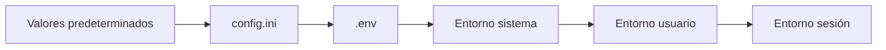

# Variables de Entorno

Las variables de entorno permiten configurar xls2sage50 sin modificar el archivo config.ini. Son especialmente útiles para:

- Configuraciones específicas por entorno (desarrollo, producción)
- Valores sensibles que no deben estar en archivos de texto
- Sobrescribir configuración temporalmente
- Integración con sistemas de orquestación

## Variables Disponibles

### Configuración de API

| Variable | Descripción | Valor Por Defecto | Ejemplo |
|----------|-------------|-------------------|---------|
| `XLS2SAGE50_API_HOST` | Host del servidor API | `localhost` | `192.168.1.100` |
| `XLS2SAGE50_API_PORT` | Puerto del servidor API | `16500` | `17000` |
| `XLS2SAGE50_API_TIMEOUT` | Timeout en segundos | `30` | `60` |

### Configuración de Directorios

| Variable | Descripción | Valor Por Defecto | Ejemplo |
|----------|-------------|-------------------|---------|
| `XLS2SAGE50_PROCESOS_DIR` | Directorio de procesos | `procesos` | `C:\Temp\procesos` |
| `XLS2SAGE50_TEMPLATES_DIR` | Directorio de plantillas | `plantillas` | `C:\Config\plantillas` |
| `XLS2SAGE50_CSV_DIR` | Directorio de salida CSV | `csv` | `C:\Export\csv` |
| `XLS2SAGE50_LOG_DIR` | Directorio de logs | `logs` | `C:\Logs\xls2sage50` |

### Configuración de Logging

| Variable | Descripción | Valor Por Defecto | Ejemplo |
|----------|-------------|-------------------|---------|
| `XLS2SAGE50_LOG_LEVEL` | Nivel de logging | `INFO` | `DEBUG` |
| `XLS2SAGE50_LOG_FILE` | Archivo de log | `xls2sage50.log` | `debug.log` |
| `XLS2SAGE50_LOG_TO_FILE` | Logging a archivo | `true` | `false` |
| `XLS2SAGE50_LOG_TO_CONSOLE` | Logging a consola | `true` | `false` |

### Configuración de Aplicación

| Variable | Descripción | Valor Por Defecto | Ejemplo |
|----------|-------------|-------------------|---------|
| `XLS2SAGE50_MODE` | Modo de operación | `BOTH` | `API` |
| `XLS2SAGE50_THEME` | Tema de la interfaz | `system` | `dark` |
| `XLS2SAGE50_LANGUAGE` | Idioma | `es` | `en` |
| `XLS2SAGE50_SILENT` | Modo silencioso | `false` | `true` |

## Configurar Variables de Entorno

### Temporal (Sesión Actual)

**CMD (Command Prompt):**
```cmd
set XLS2SAGE50_API_PORT=17000
set XLS2SAGE50_LOG_LEVEL=DEBUG
python xls2sage50.py run --template=Clientes --file=clientes.xlsx
```

**PowerShell:**
```powershell
$env:XLS2SAGE50_API_PORT = "17000"
$env:XLS2SAGE50_LOG_LEVEL = "DEBUG"
python xls2sage50.py run --template=Clientes --file=clientes.xlsx
```

### Permanente (Usuario)

**Interfaz Gráfica:**
1. Presione `Win + R`, escriba `sysdm.cpl`
2. Pestaña "Opciones avanzadas"
3. "Variables de entorno"
4. En "Variables de usuario", haga clic en "Nueva"
5. Nombre: `XLS2SAGE50_API_PORT`
6. Valor: `17000`
7. Aceptar

**Comando (PowerShell - Admin):**
```powershell
[Environment]::SetEnvironmentVariable("XLS2SAGE50_API_PORT", "17000", "User")
```

### Permanente (Sistema - Requiere Admin)

```powershell
[Environment]::SetEnvironmentVariable("XLS2SAGE50_API_PORT", "17000", "Machine")
```

## Archivo .env

xls2sage50 soporta archivos `.env` en el directorio de trabajo:

```env
# Archivo .env de ejemplo

# Configuración de API
XLS2SAGE50_API_HOST=sage50-server
XLS2SAGE50_API_PORT=16500
XLS2SAGE50_API_TIMEOUT=60

# Directorios
XLS2SAGE50_PROCESOS_DIR=C:\Datos\procesos
XLS2SAGE50_TEMPLATES_DIR=C:\Config\plantillas
XLS2SAGE50_CSV_DIR=C:\Export\csv

# Logging
XLS2SAGE50_LOG_LEVEL=DEBUG
XLS2SAGE50_LOG_FILE=debug.log
```

!!! note "Ubicación del Archivo .env**

    El archivo .env debe estar en el directorio desde donde se ejecuta xls2sage50.

## Prioridad de Configuración

Las variables se leen en este orden (última prevalece):

1. Valores predeterminados del código
2. Archivo config.ini
3. Archivo .env
4. Variables de entorno del sistema
5. Variables de entorno de usuario
6. Variables de entorno de sesión



## Ejemplos de Uso

### Desarrollo vs Producción

**Desarrollo (.env.development):**
```env
XLS2SAGE50_LOG_LEVEL=DEBUG
XLS2SAGE50_LOG_TO_CONSOLE=true
XLS2SAGE50_API_HOST=localhost
XLS2SAGE50_MODE=CSV
```

**Producción (.env.production):**
```env
XLS2SAGE50_LOG_LEVEL=WARNING
XLS2SAGE50_LOG_TO_CONSOLE=false
XLS2SAGE50_API_HOST=sage50-prod
XLS2SAGE50_MODE=API
```

### Servidores Diferentes

**Servidor de Desarrollo:**
```cmd
set XLS2SAGE50_API_HOST=dev-sage50
set XLS2SAGE50_API_PORT=16500
python xls2sage50.py
```

**Servidor de Producción:**
```cmd
set XLS2SAGE50_API_HOST=prod-sage50
set XLS2SAGE50_API_PORT=16500
python xls2sage50.py
```

### Modo Debug Temporal

```cmd
REM Activar debug temporalmente
set XLS2SAGE50_LOG_LEVEL=DEBUG
python xls2sage50.py run --template=Clientes --file=clientes.xlsx --verbose

REM Desactivar (la variable se elimina al cerrar la sesión)
set XLS2SAGE50_LOG_LEVEL=
```

## Verificación

Para verificar las variables configuradas:

```python
# script_verificar_vars.py
import os
import sys

vars_a_verificar = [
    'XLS2SAGE50_API_HOST',
    'XLS2SAGE50_API_PORT',
    'XLS2SAGE50_LOG_LEVEL',
    'XLS2SAGE50_MODE'
]

print("Variables de entorno de xls2sage50:")
print("-" * 50)

for var in vars_a_verificar:
    valor = os.environ.get(var, "<no configurada>")
    print(f"{var} = {valor}")
```

## Problemas Comunes

### Variable No Reconocida

!!! error "La variable de entorno no se aplica"

    **Causa:** La variable está configurada para sistema pero xls2sage50 se ejecuta como usuario (o viceversa)

    **Solución:**
    1. Configure la variable a nivel de usuario
    2. O reinicie el símbolo del sistema después de configurar

### Valor Incorrecto

!!! error "Valor inválido para la variable"

    **Causa:** La variable contiene un valor que no es válido (ej: texto para un puerto)

    **Solución:**
    - Verifique el tipo de dato esperado
    - Los puertos deben ser números
    - Los booleanos pueden ser true/false, 1/0, yes/no

### Espacios en Valores

Los valores con espacios deben ir entre comillas:

```cmd
REM Incorrecto
set XLS2SAGE50_PROCESOS_DIR=C:\Mi Carpeta\procesos

REM Correcto
set "XLS2SAGE50_PROCESOS_DIR=C:\Mi Carpeta\procesos"
```

## Próximo Paso

- [Directorios y Archivos](directorios.md) - Estructura de directorios de la aplicación

!!! question "¿Necesita Ayuda?**

    Consulte [Solución de Problemas](../../solucion-problemas/index.md) si tiene problemas con la configuración.
