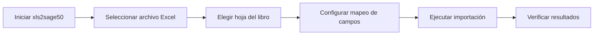

# Bienvenido a xls2sage50

{ align=right }

**xls2sage50** es una aplicación profesional diseñada para simplificar la importación de datos desde archivos Microsoft Excel hacia el software de gestión contable SAGE 50.

Esta herramienta permite ahorrar horas de trabajo manual, eliminando los errores humanos y agilizando significativamente el proceso de incorporación de datos al sistema contable.

## Características Principales

### Importación Directa por API
Conecta directamente con SAGE 50 mediante su API oficial e importa datos de forma automática sin necesidad de archivos intermedios.

### Generación de CSV/SQL
Genera archivos CSV y scripts SQL listos para importar manualmente en SAGE 50, ideal para entornos donde la API no está disponible.

### Interfaz Gráfica Intuitiva
Interfaz moderna y fácil de usar basada en Flet, diseñada para usuarios tanto técnicos como no técnicos.

### Gestión de Plantillas
Guarda y reutiliza configuraciones de importación para trabajar de forma eficiente con archivos recurrentes.

### Línea de Comandos
Automatiza procesos mediante scripts por lotes usando la interfaz de línea de comandos (CLI).

## ¿Para quién es esta aplicación?

!!! info "Perfiles de Usuario"

    - **Contables y Administradores:** Simplifican la carga masiva de asientos, clientes y proveedores.
    - **Departamentos de TI:** Automatizan procesos recurrentes mediante scripts y plantillas.
    - **Empresas de Servicios:** Gestionan importaciones para múltiples clientes de forma estandarizada.
    - **Autónomos y PYMES:** Reducen el tiempo dedicado a tareas administrativas repetitivas.

## Modos de Operación

xls2sage50 funciona en dos modos principales:

### Modo API
El modo API permite la importación directa de datos a SAGE 50 utilizando la API oficial. Este modo requiere:

- SAGE 50 instalado y configurado con el módulo API habilitado
- Licencia de SAGE 50 que incluya acceso por API
- Configuración de conexión válida

**Ventajas del modo API:**
- Importación automática sin intervención manual
- Validación inmediata de datos
- Actualización en tiempo real del progreso
- Menor riesgo de errores humanos

### Modo CSV
El modo CSV genera archivos de texto CSV y scripts SQL que pueden importarse manualmente en SAGE 50.

**Ventajas del modo CSV:**
- No requiere licencia API de SAGE 50
- Compatible con todas las versiones de SAGE 50
- Permite revisión previa de los datos
- Ideal para entornos con restricciones de seguridad

## Requisitos Mínimos

!!! note "Requisitos del Sistema"

    - **Sistema Operativo:** Windows 10 o superior
    - **Python:** 3.12 o superior (para instalación desde fuente)
    - **Memoria RAM:** 4 GB mínimo (8 GB recomendado)
    - **Espacio en Disco:** 500 MB para la aplicación
    - **SAGE 50:** Versión 2020 o superior (opcional para modo CSV)

Para más detalles sobre los requisitos, consulte la sección de [Instalación y Requisitos](instalacion/requisitos.md).

## Primeros Pasos

### Instalación Rápida

1. **Descargar el instalador** desde el repositorio oficial
2. **Ejecutar el instalador** y seguir las instrucciones
3. **Iniciar la aplicación** desde el escritorio

Para instrucciones detalladas, visite la [Guía de Instalación](instalacion/instalacion.md).

### Tu Primera Importación

Para un tutorial paso a paso, consulte la [Guía de Inicio Rápido](inicio-rapido/primeros-pasos.md).

## Estructura de la Documentación

| Sección | Descripción |
|---------|-------------|
| [Instalación](instalacion/index.md) | Guía completa de instalación y configuración inicial |
| [Inicio Rápido](inicio-rapido/index.md) | Tutorial para tu primera importación |
| [Modo API](modo-api/index.md) | Documentación del modo de importación por API |
| [Modo CSV](modo-csv/index.md) | Documentación del modo de generación de archivos |
| [Plantillas](plantillas/index.md) | Gestión y reutilización de configuraciones |
| [Interfaz Gráfica](interfaz-grafica/index.md) | Referencia completa de la interfaz de usuario |
| [Línea de Comandos](linea-comandos/index.md) | Guía de automatización mediante scripts |
| [Configuración](configuracion/index.md) | Configuración avanzada y personalización |
| [Solución de Problemas](solucion-problemas/index.md) | Solución de errores comunes y soporte |

## Ejemplo de Uso

A continuación, se muestra un ejemplo básico de cómo importar un archivo de clientes desde Excel:

!!! example "Importar Clientes desde Excel"

    1. Abre xls2sage50
    2. Haz clic en **"Seleccionar Archivo"** y elige tu archivo Excel
    3. Selecciona la hoja que contiene los clientes
    4. Configura el mapeo de columnas (por ejemplo, "Nombre" → "NombreCliente")
    5. Haz clic en **"Importar"** y espera a que finalice el proceso

## Soporte y Ayuda

Si encuentras algún problema o tienes preguntas:

- Consulta la sección de [Solución de Problemas](solucion-problemas/index.md)
- Revisa los [Ejemplos Prácticos](inicio-rapido/ejemplo-practico.md)
- Contacta con el [Soporte Técnico](solucion-problemas/soporte.md)

## Novedades en esta Versión

!!! tip "Versión Actual: Rama geminis"

    - Migración completa a **Polars** para procesamiento de Excel (10x más rápido)
    - Nueva interfaz gráfica basada en **Flet**
    - Soporte mejorado para archivos grandes
    - Sistema de logging mejorado
    - Mejoras en la gestión de plantillas

## Próximos Pasos

Una vez instalada la aplicación, te recomendamos seguir este orden:

1. Lee la [Guía de Instalación](instalacion/instalacion.md) si no has instalado la aplicación aún
2. Sigue el [Tutorial de Inicio Rápido](inicio-rapido/primeros-pasos.md) para familiarizarte con la interfaz
3. Consulta la documentación específica según tu modo de operación:
   - [Modo API](modo-api/index.md) para importación directa
   - [Modo CSV](modo-csv/index.md) para generación de archivos
4. Aprende a crear [Plantillas](plantillas/index.md) para automatizar tu flujo de trabajo

---

¿Listo para comenzar? Empieza con la [Instalación](instalacion/instalacion.md) o salta directamente al [Inicio Rápido](inicio-rapido/primeros-pasos.md).
