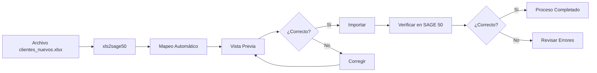

# Ejemplo Práctico: Importación de Clientes

En este ejemplo, guiaremos un caso real de importación de un archivo de clientes desde Excel hacia SAGE 50.

## Escenario

Una empresa recibe mensualmente un archivo Excel de su sistema de ventas con nuevos clientes que deben incorporarse a SAGE 50.

**Objetivo:** Importar automáticamente los clientes sin tener que introducirlos manualmente uno a uno.

## Archivo de Entrada

### Estructura del Archivo Excel

El archivo `clientes_nuevos.xlsx` tiene la siguiente estructura:

| CODIGO | NOMBRE | DIRECCION | POBLACION | PROVINCIA | CP | TELEFONO | EMAIL | NIF |
|--------|--------|-----------|-----------|-----------|-----|----------|-------|-----|
| CLI001 | Empresa ABC | C/ Mayor 1 | Madrid | Madrid | 28001 | 910000001 | info@abc.com | A12345678 |
| CLI002 | Distribuciones XYZ | Av. Libertad 2 | Barcelona | Barcelona | 08001 | 930000002 | ventas@xyz.es | B87654321 |
| CLI003 | Servicios Norte | Pza. España 3 | Valencia | Valencia | 46001 | 960000003 | contacto@norte.com | C11223344 |

!!! note "Campos del Archivo"

    - **CODIGO:** Identificador único del cliente (obligatorio en SAGE 50)
    - **NOMBRE:** Razón social o nombre del cliente (obligatorio)
    - **Resto de campos:** Información adicional de contacto

## Paso 1: Preparar el Archivo

### Verificar Formato

Antes de importar, asegúrese de que:

1. **El archivo está cerrado** en Excel
2. **Los encabezados están en la fila 1**
3. **No hay filas vacías** entre los datos
4. **Los códigos son únicos** (no duplicados)

### Guardar una Copia de Seguridad

```bash
# Crear copia de seguridad
copy clientes_nuevos.xlsx clientes_nuevos_backup.xlsx
```

!!! tip "Siempre Trabaje con Copias**

    Mantenga siempre una copia del archivo original por si necesita revertir cambios.

## Paso 2: Iniciar xls2sage50

1. Abra xls2sage50
2. Seleccione la pestaña **"Proceso API"** (si tiene licencia API)
   O seleccione **"Proceso CSV"** si prefiere generar archivos

## Paso 3: Cargar el Archivo

1. Haga clic en **"Seleccionar Archivo"**
2. Navegue hasta la ubicación de `clientes_nuevos.xlsx`
3. Seleccione el archivo


4.Seleccione la hoja que contiene los clientes (normalmente "Hoja1" o "Clientes")

## Paso 4: Configurar el Mapeo

xls2sage50 detectará automáticamente las columnas. El mapeo debería ser:

| Columna Excel | Campo SAGE 50 | ¿Mapeado? |
|---------------|---------------|-----------|
| CODIGO | CodigoCliente | :white_check_mark: |
| NOMBRE | Nombre | :white_check_mark: |
| DIRECCION | Direccion | :white_check_mark: |
| POBLACION | Poblacion | :white_check_mark: |
| PROVINCIA | Provincia | :white_check_mark: |
| CP | CodigoPostal | :white_check_mark: |
| TELEFONO | Telefono1 | :white_check_mark: |
| EMAIL | Email | :white_check_mark: |
| NIF | NIF | :white_check_mark: |

### Ajustar Mapeo si es Necesario

Si alguna columna no se ha mapeado correctamente:

1. Haga clic en **"Editar Mapeo"**
2. Para cada columna sin mapear, seleccione el campo correspondiente
3. Haga clic en **"Aceptar"**

## Paso 5: Configurar Opciones

Para este ejemplo, configuraremos:

| Opción | Valor | Razón |
|--------|-------|-------|
| **Modo de importación** | Insertar nuevos | Solo queremos agregar clientes nuevos |
| **Si existe código** | Omitir registro | Evitar duplicados |
| **Validar NIF** | Sí | Verificar formato del NIF |
| **Crear contacto** | Sí | Crear registro de contacto adicional |

## Paso 6: Vista Previa

Antes de importar, revise la vista previa:


1. Verifique que los datos se muestran correctamente
2. Compruebe que los formatos son correctos (fechas, números, etc.)
3. Confirme que la cantidad de registros es la esperada (3 clientes)

!!! warning "Revise Siempre la Vista Previa**

    La vista previa le permite detectar problemas antes de la importación, ahorrando tiempo y evitando errores.

## Paso 7: Guardar como Plantilla

Dado que esta importación se realizará mensualmente:

1. Haga clic en **"Guardar como Plantilla"**
2. Nombre: `Importacion_Clientes_Mensual`
3. Descripción: `Importación de nuevos clientes desde archivo mensual`
4. Haga clic en **"Guardar"**

## Paso 8: Ejecutar la Importación

1. Haga clic en el botón **"Importar"**
2. Aparecerá la barra de progreso


3. El proceso mostrará:
   - **Registro 1 de 3:** Importando Cliente CLI001...
   - **Registro 2 de 3:** Importando Cliente CLI002...
   - **Registro 3 de 3:** Importando Cliente CLI003...

## Paso 9: Verificar Resultados

Al finalizar, debería ver:


| Campo | Valor |
|-------|-------|
| Registros leídos | 3 |
| Registros importados | 3 |
| Registros con error | 0 |
| Tiempo transcurrido | 2 segundos |

## Paso 10: Verificar en SAGE 50

Para confirmar que la importación fue exitosa:

1. Abra SAGE 50
2. Vaya a **Clientes** > **Listado de Clientes**
3. Busque los clientes importados (CLI001, CLI002, CLI003)
4. Abra uno de ellos y verifique que todos los datos son correctos

## Qué Hacer si Hay Errores

### Error: Código Duplicado

Si aparece el error "El código ya existe":

1. Verifique en SAGE 50 si el cliente ya existe
2. Si existe, use el modo **"Actualizar existentes"**
3. O cambie el código en el archivo Excel

### Error: Formato de NIF Incorrecto

Si el NIF tiene formato inválido:

1. Revise el formato del NIF en el archivo Excel
2. Asegúrese de que tiene 8 dígitos + letra (para DNI) o formato correcto (CIF, NIE)
3. Corrija los datos y ejecute nuevamente

### Error: Campo Obligatorio Vacío

Si falta un campo obligatorio:

1. Revise qué campo está marcado como obligatorio en el mensaje de error
2. Complete los datos faltantes en el archivo Excel
3. Ejecute la importación nuevamente

## Próximas Importaciones (Usando la Plantilla)

Para importaciones futuras con la misma estructura:

1. Abra xls2sage50
2. Vaya a la sección **Plantillas**
3. Seleccione `Importacion_Clientes_Mensual`
4. Haga clic en **"Cargar"**
5. Seleccione el nuevo archivo Excel
6. Haga clic en **"Importar"**

!!! tip "Ahorre Tiempo con Plantillas**

    El uso de plantillas reduce el tiempo de importación de varios minutos a unos segundos.

## Resumen del Ejemplo



## Otros Ejemplos

### Importación de Artículos

El proceso es similar para importar artículos:

| Campo Excel | Campo SAGE 50 |
|-------------|---------------|
| CODIGO | CodigoArticulo |
| DESCRIPCION | Descripcion |
| PRECIO | PrecioVenta |
| STOCK | StockActual |
| FAMILIA | Familia |

### Importación de Proveedores

Para proveedores:

| Campo Excel | Campo SAGE 50 |
|-------------|---------------|
| CODIGO | CodigoProveedor |
| RAZON_SOCIAL | Nombre |
| TELEFONO | Telefono |
| EMAIL | Email |

## Próximo Paso

- [Modo API](../modo-api/index.md) - Aprenda más sobre la importación directa
- [Plantillas](../plantillas/index.md) - Gestione sus configuraciones guardadas

!!! question "¿Necesita Más Ejemplos?"

    Consulte la sección de [Ejemplos de Uso](../modo-api/ejemplos.md) para más casos prácticos.
