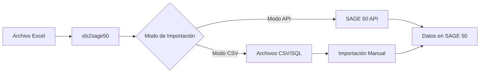
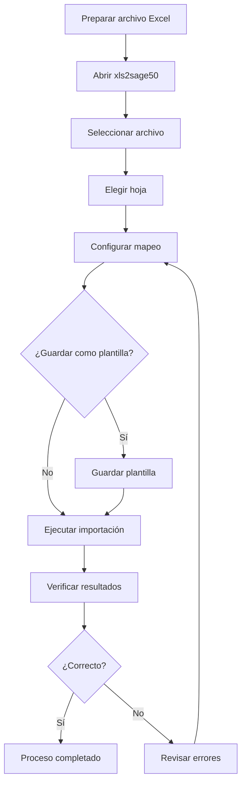

# Inicio Rápido

Bienvenido a la guía de inicio rápido de xls2sage50. En esta sección aprenderá los conceptos básicos y realizará su primera importación en pocos minutos.

## ¿Qué Aprenderá?

Esta guía le enseñará a:

1. [Primeros Pasos](primeros-pasos.md) - Conocer la interfaz de xls2sage50
2. [Importación Básica](importacion-basica.md) - Realizar una primera importación simple
3. [Ejemplo Práctico](ejemplo-practico.md) - Seguir un caso de uso real

## Antes de Comenzar

!!! note "Requisitos Previos"

    Asegúrese de haber completado:
    - [x] Instalación de xls2sage50
    - [x] Configuración inicial
    - [x] Verificación de la instalación

Si no ha completado estos pasos, visite la sección de [Instalación](../instalacion/index.md).

## Conceptos Básicos

### ¿Qué es una Importación?

Una **importación** es el proceso de transferir datos desde un archivo Excel hacia SAGE 50. El proceso consta de tres etapas principales:

### Componentes del Flujo de Trabajo

| Componente | Descripción |
|------------|-------------|
| **Archivo Excel** | El archivo de origen que contiene los datos a importar |
| **Hoja** | La pestaña específica del libro de Excel con los datos |
| **Mapeo** | La relación entre columnas de Excel y campos de SAGE 50 |
| **Plantilla** | Una configuración guardada que puede reutilizarse |
| **Importación** | El proceso de transferencia de datos |

## Tu Primera Importación en 5 Minutos

Siga estos pasos para realizar su primera importación:

### Paso 1: Preparar el Archivo Excel

Asegúrese de que su archivo Excel tenga:

- Una fila de encabezados con nombres de columnas
- Datos consistentes en cada columna
- Sin filas vacías entre los datos

**Ejemplo de estructura:**

| Código | Nombre | Precio | Stock |
|--------|--------|--------|-------|
| ART001 | Producto A | 10.50 | 100 |
| ART002 | Producto B | 25.00 | 50 |

### Paso 2: Abrir xls2sage50

1. Haga doble clic en el acceso directo de xls2sage50
2. Espere a que cargue la interfaz principal

### Paso 3: Seleccionar el Archivo

1. Haga clic en el botón **"Seleccionar Archivo"**
2. Busque y seleccione su archivo Excel
3.Seleccione la hoja que contiene los datos

### Paso 4: Configurar el Mapeo

1. Revise las columnas detectadas automáticamente
2. Ajuste el mapeo si es necesario
3. Seleccione el tipo de entidad (Clientes, Artículos, etc.)

### Paso 5: Ejecutar la Importación

1. Haga clic en **"Importar"**
2. Espere a que finalice el proceso
3. Revise el resumen de resultados

## Flujo de Trabajo Completo

## Próximos Pasos

Una vez completada su primera importación:

- [Importación Básica](importacion-basica.md) - Aprenda más detalles sobre el proceso
- [Ejemplo Práctico](ejemplo-practico.md) - Siga un caso de uso real
- [Modo API](../modo-api/index.md) - Profundice en la importación por API
- [Modo CSV](../modo-csv/index.md) - Aprenda a generar archivos CSV

## Necesita Ayuda?

Si encuentra problemas durante el proceso:

- Consulte [Solución de Problemas](../solucion-problemas/comunes.md)
- Revise [Ejemplo Práctico](ejemplo-practico.md) para ver un caso completo
- Contacte con [Soporte Técnico](../solucion-problemas/soporte.md)
