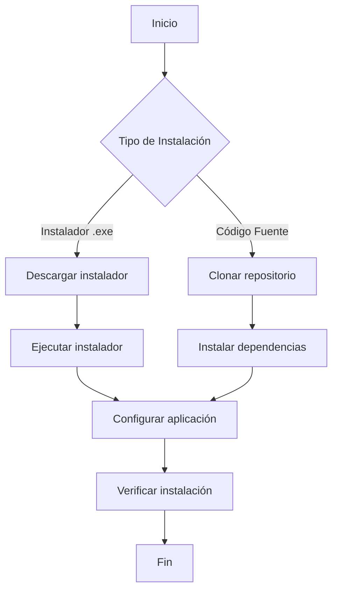

# Instalación y Requisitos del Sistema

Esta sección le guiará a través del proceso de instalación de xls2sage50 en su sistema. Siga estos pasos para configurar la aplicación correctamente.

## Contenido de esta Sección

1. [Requisitos del Sistema](requisitos.md) - Conocer los requisitos hardware y software
2. [Instalación](instalacion.md) - Pasos detallados de instalación
3. [Configuración Inicial](configuracion-inicial.md) - Primera configuración de la aplicación
4. [Verificación](verificacion.md) - Comprobar que todo funciona correctamente

## Opciones de Instalación

xls2sage50 puede instalarse de dos formas:

### Opción A: Instalador Ejecutable (Recomendado)

La forma más sencilla de instalar xls2sage50 es mediante el instalador ejecutable `.exe`:

!!! tip "Ventajas del Instalador"

    - No requiere conocimientos de Python
    - Instalación con un solo clic
    - Todas las dependencias incluidas
    - Accesos directos creados automáticamente

### Opción B: Instalación desde Código Fuente

Para usuarios avanzados o desarrolladores que prefieren instalar desde código fuente:

!!! note "Requisitos Adicionales"

    - Python 3.12 o superior instalado
    - pip (gestor de paquetes de Python)
    - Git (opcional, para clonar el repositorio)

## Proceso de Instalación Resumido

## Antes de Comenzar

Antes de iniciar la instalación, asegúrese de:

1. **Tener permisos de administrador** en el equipo
2. **Cerrar SAGE 50** si está abierto
3. **Disponer de espacio en disco** (mínimo 500 MB)
4. **Tener a mano la licencia** de SAGE 50 (si usará modo API)

## Siguiente Paso

Seleccione el método de instalación que prefiera:

- [Requisitos del Sistema](requisitos.md) - Compruebe si su equipo es compatible
- [Instalación con Ejecutable](instalacion.md) - Guía paso a paso con el instalador
- [Configuración Inicial](configuracion-inicial.md) - Configure la aplicación por primera vez
- [Verificación de Instalación](verificacion.md) - Compruebe que todo funciona

!!! question "¿Necesita Ayuda?"

    Si encuentra problemas durante la instalación, consulte la sección de [Solución de Problemas](../solucion-problemas/comunes.md).
