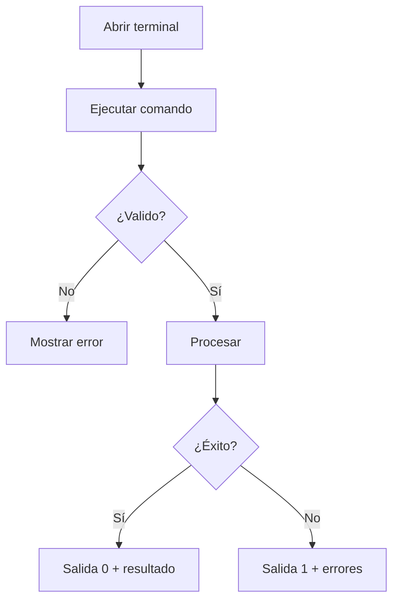

# Línea de Comandos

xls2sage50 incluye una interfaz de línea de comandos (CLI) que permite automatizar procesos y crear scripts por lotes sin necesidad de usar la interfaz gráfica.

## Ventajas de la Línea de Comandos

| Ventaja | Descripción |
|---------|-------------|
| :white_check_mark: **Automatización** | Crear tareas programadas |
| :white_check_mark: **Integración** | Usar en scripts y pipelines |
| :white_check_mark: **Sin interfaz** | Funciona en servidores sin GUI |
| :white_check_mark: **Rápido** | Ejecución directa sin pasos intermedios |
| :white_check_mark: **Repetible** | Misma configuración siempre |

## Contenido de esta Sección

1. [Comandos Disponibles](comandos.md) - Lista completa de comandos y opciones
2. [Automatización](automatizacion.md) - Crear tareas programadas y scripts
3. [Scripts por Lotes](scripts-lotes.md) - Ejemplos de scripts prácticos

## Sintaxis Básica

```bash
python xls2sage50.py [COMANDO] [OPCIONES]
```

### Ejemplo Básico

```bash
# Mostrar ayuda
python xls2sage50.py --help

# Listar plantillas
python xls2sage50.py list

# Ejecutar una plantilla
python xls2sage50.py run --template=Clientes_Mensual --file=datos.xlsx
```

## Comandos Principales

| Comando | Descripción |
|---------|-------------|
| `run` | Ejecutar una plantilla de importación |
| `validate` | Validar una plantilla sin importar |
| `list` | Listar plantillas disponibles |
| `info` | Mostrar información de una plantilla |
| `help` | Mostrar ayuda de comandos |

## Salida de Comandos

### Códigos de Salida

| Código | Significado |
|--------|-------------|
| `0` | Ejecución exitosa |
| `1` | Errores en la ejecución |
| `2` | Argumentos inválidos |
| `3` | Archivo no encontrado |
| `4` | Error de conexión |

### Formato de Salida

La salida puede ser:

- **Texto plano:** Para lectura en consola
- **JSON:** Para procesamiento por scripts
- **Silencioso:** Sin salida (solo código de salida)

## Flujo de Trabajo con CLI



## Uso en Scripts

### Script Básico

```batch
@echo off
REM Importación de clientes

set ARCHIVO=clientes_febrero.xlsx
set PLANTILLA=Clientes_Mensual

echo Iniciando importación...
python xls2sage50.py run --template=%PLANTILLA% --file=%ARCHIVO%

if %ERRORLEVEL% EQU 0 (
    echo Importación exitosa
) else (
    echo Error en importación: %ERRORLEVEL%
    exit /b %ERRORLEVEL%
)
```

## Integración con Tareas Programadas

### Windows Task Scheduler

1. Abra el **Programador de Tareas**
2. Cree una **Tarea Básica**
3. Configure:
   - **Desencadenador:** Diariamente a las 02:00 AM
   - **Acción:** Iniciar programa
   - **Programa:** `python`
   - **Argumentos:** `xls2sage50.py run --template=Clientes_Mensual --file=clientes.xlsx`

## Próximo Paso

- [Comandos Disponibles](comandos.md) - Lista completa de comandos y opciones

!!! tip "Primeros Pasos con CLI**

    Comience usando el comando `--help` para explorar todas las opciones disponibles.
