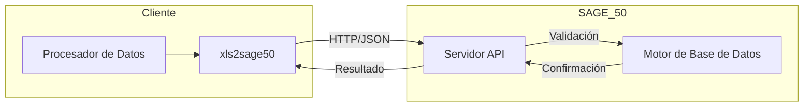
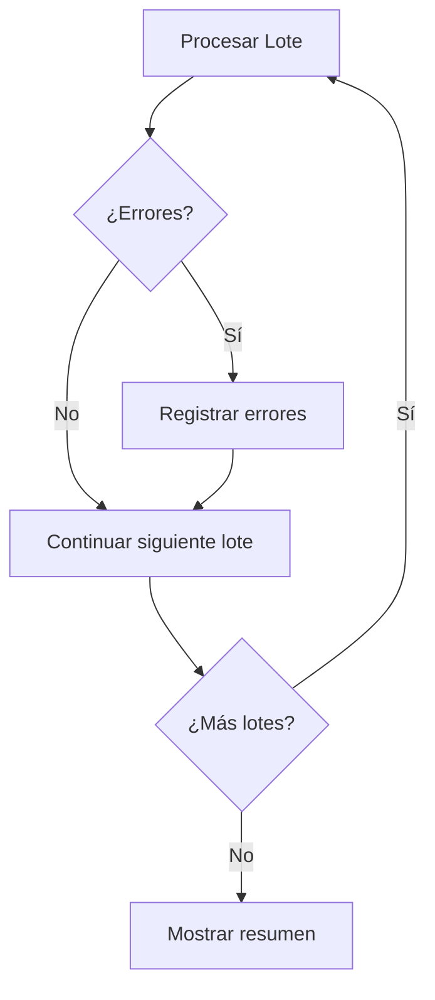
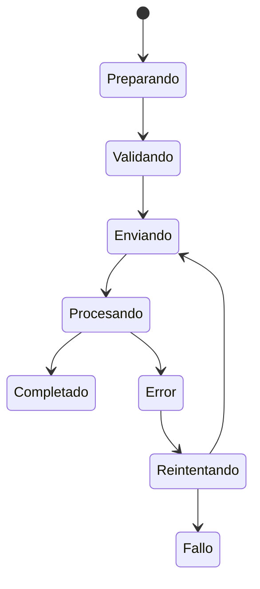

# Conceptos del Modo API

En esta sección entenderá cómo funciona el modo API de xls2sage50, su arquitectura y los conceptos clave para un uso eficiente.

## Arquitectura del Sistema

El modo API se basa en una arquitectura cliente-servidor:



### Componentes

| Componente | Descripción |
|------------|-------------|
| **xls2sage50** | Aplicación cliente que prepara y envía los datos |
| **Procesador de Datos** | Módulo que valida y transforma los datos |
| **Servidor API SAGE 50** | Servidor que recibe las peticiones de importación |
| **Motor de Base de Datos** | Almacena los datos en SAGE 50 |

## Flujo de Comunicación

### 1. Establecimiento de Conexión

```python
# Ejemplo simplificado de conexión
api = Sage50API(host="localhost", port=16500)
api.connect()
```

La conexión se establece mediante:

- **Protocolo:** HTTP/HTTPS
- **Formato:** JSON
- **Autenticación:** Token de sesión
- **Puerto predeterminado:** 16500

### 2. Envío de Datos

Los datos se envían en formato JSON:

```json
{
  "entidad": "Cliente",
  "operacion": "insertar",
  "datos": [
    {
      "codigo": "CLI001",
      "nombre": "Empresa ABC",
      "nif": "A12345678"
    }
  ]
}
```

### 3. Recepción de Respuesta

SAGE 50 responde con el resultado:

```json
{
  "estado": "exito",
  "registros_procesados": 1,
  "registros_error": 0,
  "mensaje": "Importación completada"
}
```

## Procesamiento por Lotes

Para optimizar el rendimiento, los datos se procesan en lotes:

### Configuración de Lotes

| Parámetro | Valor Predeterminado | Rango Permitido |
|-----------|---------------------|-----------------|
| Tamaño de lote | 100 registros | 10-1000 |
| Timeout | 30 segundos | 5-300 |
| Reintentos | 3 | 0-10 |

### Ventajas del Procesamiento por Lotes

- :white_check_mark: **Mejor rendimiento:** Reduce la sobrecarga de conexión
- :white_check_mark: **Recuperación de errores:** Si falla un lote, solo se repite ese lote
- :white_check_mark: **Feedback continuo:** Progreso visible durante la importación

!!! tip "Ajuste según su Conexión**

    Para conexiones rápidas (LAN), use lotes grandes (500+). Para conexiones lentas (VPN), use lotes pequeños (50-100).

## Validación de Datos

### Tipos de Validación

| Tipo | Cuándo se Realiza | Errores Típicos |
|------|-------------------|-----------------|
| **Estructural** | Al cargar el archivo | Columnas faltantes |
| **De formato** | Antes de enviar a API | Formato de NIF incorrecto |
| **De negocio** | En SAGE 50 | Código duplicado |
| **De referencia** | En SAGE 50 | Familia inexistente |

### Reglas de Validación Comunes

#### NIF/CIF

```
- DNI: 8 dígitos + letra
- CIF: Letra + 7 dígitos + código de control
- NIE: X/Y/Z + 7 dígitos + letra
```

#### Códigos Postales

```
- España: 5 dígitos
- Primera cifra: 01-52 (provincias)
```

#### Teléfonos

```
- 9 dígitos (sin prefijo)
- O formato internacional: +34 XXX XXX XXX
```

## Gestión de Errores

### Tipos de Errores

| Error | Causa | Solución |
|-------|-------|----------|
| **Conexión rechazada** | SAGE 50 no está ejecutándose | Iniciar SAGE 50 |
| **Timeout** | Lote demasiado grande | Reducir tamaño de lote |
| **Validación fallida** | Dato incorrecto | Corregir dato en Excel |
| **Duplicado** | Código ya existe | Actualizar en lugar de insertar |

### Estrategias de Manejo

#### Continuar ante Errores



#### Detener ante Errores

El proceso se detiene inmediatamente al encontrar el primer error.

!!! warning "Elija la Estrategia Adecuada**

    - Use **"Continuar"** para importaciones grandes donde algunos errores son aceptables
    - Use **"Detener"** para procesos críticos donde todos los registros deben ser correctos

## Estados de Importación

Durante el proceso de importación, cada registro pasa por varios estados:



### Descripción de Estados

| Estado | Descripción |
|--------|-------------|
| **Preparando** | El registro se está preparando para enviar |
| **Validando** | Se están validando los datos del registro |
| **Enviando** | El registro se está enviando a SAGE 50 |
| **Procesando** | SAGE 50 está procesando el registro |
| **Completado** | El registro se importó correctamente |
| **Error** | Hubo un error en la importación |
| **Reintentando** | Se está reintentando la operación |
| **Fallo** | La operación falló después de varios intentos |

## Transacciones y Rollback

### Confirmación en Dos Fases

SAGE 50 utiliza confirmación en dos fases (2PC) para garantizar la integridad:

1. **Fase de preparación:** SAGE 50 valida que puede procesar todos los registros
2. **Fase de confirmación:** SAGE 50 confirma la transacción

!!! tip "Integridad Garantizada**

    Si algo falla durante la confirmación, todos los cambios se revierten automáticamente (rollback).

## Rendimiento y Optimización

### Factores que Afectan el Rendimiento

| Factor | Impacto | Optimización |
|--------|---------|--------------|
| **Tamaño de lote** | Alto | Ajustar según conexión |
| **Complejidad de validación** | Medio | Simplificar datos |
| **Velocidad de conexión** | Alto | Usar conexión cableada |
| **Carga del servidor** | Medio | Importar en horas valle |

### Mejores Prácticas

1. **Importar en horas valle:** Cuando SAGE 50 tiene menos carga
2. **Usar lotes grandes:** Para conexiones rápidas
3. **Validar antes:** Evitar enviar datos con errores
4. **Monitorizar logs:** Revisar errores para optimizar

## Próximo Paso

- [Conexión con SAGE 50](conexion.md) - Configure y pruebe la conexión

!!! question "¿Dudas sobre el Modo API?**

    Consulte la sección de [Solución de Problemas](../../solucion-problemas/errores-conexion.md) para resolver problemas comunes de conexión.
