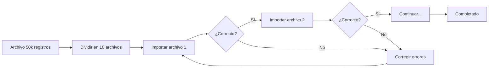

# Ejemplos de Uso del Modo API

En esta sección encontrará ejemplos prácticos detallados de cómo utilizar el modo API de xls2sage50 para diferentes escenarios de importación.

## Ejemplo 1: Importación de Clientes

### Escenario

Una empresa recibe un archivo mensual de su sistema CRM con nuevos clientes que deben incorporarse a SAGE 50.

### Archivo de Entrada

| CODIGO | NOMBRE | NIF | DIRECCION | POBLACION | PROVINCIA | CP | TELEFONO | EMAIL |
|--------|--------|-----|-----------|-----------|-----------|-----|----------|-------|
| CLI001 | Juan Pérez SL | B12345678 | C/ Mayor 1 | Madrid | Madrid | 28001 | 910000001 | info@juanperez.es |
| CLI002 | María López SA | A87654321 | Av. Libertad 2 | Barcelona | Barcelona | 08001 | 920000002 | maria@lopez.com |

### Configuración del Mapeo

| Columna Excel | Campo SAGE 50 |
|---------------|---------------|
| CODIGO | CodigoCliente |
| NOMBRE | NombreCliente |
| NIF | NIF |
| DIRECCION | Direccion |
| POBLACION | Poblacion |
| PROVINCIA | Provincia |
| CP | CodigoPostal |
| TELEFONO | Telefono1 |
| EMAIL | Email |

### Opciones de Importación

```yaml
Modo: Insertar nuevos
Si existe código: Omitir registro
Validar NIF: Sí
Crear contacto: Sí
```

### Código de Ejemplo (CLI)

```bash
# Ejecutar importación desde línea de comandos
python xls2sage50.py run --template=clientes_mensual --file=clientes_nuevos.xlsx
```

## Ejemplo 2: Actualización de Precios de Artículos

### Escenario

El proveedor envía un archivo con los nuevos precios de artículos que deben actualizarse en SAGE 50.

### Archivo de Entrada

| CODIGO | PRECIO_VENTA | PRECIO_COSTE | IVA |
|--------|--------------|--------------|-----|
| ART001 | 25.50 | 15.00 | 21 |
| ART002 | 45.00 | 27.50 | 21 |
| ART003 | 12.75 | 8.00 | 10 |

### Configuración del Mapeo

| Columna Excel | Campo SAGE 50 |
|---------------|---------------|
| CODIGO | CodigoArticulo |
| PRECIO_VENTA | PrecioVenta |
| PRECIO_COSTE | PrecioCoste |
| IVA | TipoIVA |

### Opciones de Importación

```yaml
Modo: Actualizar existentes
Campo clave: CodigoArticulo
Validar precios: Sí (mayor que 0)
```

!!! tip "Actualizar Solo Campos Necesarios**

    Configure xls2sage50 para actualizar solo los campos de precio, sin modificar otros datos del artículo.

## Ejemplo 3: Importación de Asientos Contables

### Escenario

Importar asientos contables desde un archivo generado por el sistema de facturación.

### Archivo de Entrada

| FECHA | CUENTA | CONCEPTO | DEBE | HABER |
|-------|--------|----------|------|-------|
| 01/02/2024 | 4300001 | Factura F001 | 1210.00 | 0 |
| 01/02/2024 | 7000001 | Venta mercancía | 0 | 1000.00 |
| 01/02/2024 | 4770001 | IVA repercutido | 0 | 210.00 |
| 01/02/2024 | 5720001 | Factura F001 cobrada | 1210.00 | 0 |
| 01/02/2024 | 4300001 | Factura F001 | 0 | 1210.00 |

### Configuración del Mapeo

| Columna Excel | Campo SAGE 50 | Transformación |
|---------------|---------------|----------------|
| FECHA | Fecha | DD/MM/AAAA a AAAA-MM-DD |
| CUENTA | Cuenta | Sin transformación |
| CONCEPTO | Concepto | Sin transformación |
| DEBE | ImporteDebe | Decimal |
| HABER | ImporteHaber | Decimal |

### Opciones de Importación

```yaml
Modo: Insertar nuevos
Validar cuentas: Sí
Verificar balance: Sí
Generar contrapartida: No
```

!!! warning "Asientos Cuadrados**

    Asegúrese de que cada asiento está cuadrado (suma del debe = suma del haber) antes de importar.

## Ejemplo 4: Importación de Proveedores

### Escenario

Importar un archivo de nuevos proveedores recibido del departamento de compras.

### Archivo de Entrada

| CODIGO | RAZON_SOCIAL | NIF | DIRECCION | POBLACION | PROVINCIA | CP | PAIS |
|--------|--------------|-----|-----------|-----------|-----------|-----|------|
| PROV001 | Suministros Gama SL | B11111111 | Polígono Industrial | Valencia | Valencia | 46001 | ESP |
| PROV002 | Material Norte SA | C22222222 | C/ Fábrica 1 | Bilbao | Vizcaya | 48001 | ESP |

### Configuración del Mapeo

| Columna Excel | Campo SAGE 50 |
|---------------|---------------|
| CODIGO | CodigoProveedor |
| RAZON_SOCIAL | Nombre |
| NIF | NIF |
| DIRECCION | Direccion |
| POBLACION | Poblacion |
| PROVINCIA | Provincia |
| CP | CodigoPostal |
| PAIS | Pais |

## Ejemplo 5: Importación Masiva de 50.000 Registros

### Escenario

Una empresa debe importar un catálogo completo de 50.000 artículos.

### Estrategia

Para volúmenes grandes:

1. **Dividir en lotes:** Dividir el archivo en varios de 5.000 registros
2. **Importar secuencialmente:** Importar un lote a la vez
3. **Verificar cada lote:** Confirmar que cada lote se importó correctamente
4. **Optimizar tamaño de lote:** Usar lotes de 500 registros por envío

### Configuración

```yaml
Tamaño de lote: 500
Timeout: 60 segundos
Reintentos: 5
Manejo de errores: Continuar
```

### Proceso



!!! tip "Importación por Fases**

    Para archivos muy grandes, considere importar en varios días o en horas de menor actividad.

## Ejemplo 6: Importación con Transformaciones

### Escenario

Importar clientes donde los nombres deben estar en mayúsculas y los teléfonos sin espacios ni guiones.

### Archivo de Entrada

| CODIGO | NOMBRE | TELEFONO |
|--------|--------|----------|
| CLI001 | Juan Pérez y Cía | 912 345 678 |
| CLI002 | ABC Distribuciones | +34-93-123-45-67 |

### Transformaciones Configuradas

| Campo | Transformación | Parámetros |
|-------|----------------|------------|
| NOMBRE | Mayúsculas | - |
| TELEFONO | Eliminar caracteres | Eliminar: espacio, guion, + |
| TELEFONO | Longitud fija | 9 caracteres |

### Resultado

| CODIGO | NOMBRE | TELEFONO |
|--------|--------|----------|
| CLI001 | JUAN PÉREZ Y CÍA | 912345678 |
| CLI002 | ABC DISTRIBUCIONES | 931234567 |

## Ejemplo 7: Importación con Validaciones

### Escenario

Importar facturas con validaciones específicas de negocio.

### Reglas de Validación

| Campo | Validación | Parámetros |
|-------|------------|------------|
| IMPORTE | Rango | Mín: 0.01, Máx: 999999.99 |
| NIF | Formato | Patrón: ^[0-9A-Z][0-9]{7}[A-Z0-9]$ |
| FECHA | Rango | Desde: hoy - 30 días, Hasta: hoy + 7 días |
| SERIE | Lista | A, B, C, X, Y |

### Configuración

```yaml
Validaciones: Activas
Acción ante error: Detener
Reporte: Detallado
```

## Ejemplo 8: Automatización con Scripts

### Script por Lotes (Batch)

```batch
@echo off
REM Importación automática nocturna

REM Configurar variables
set ARCHIVO=C:\Importaciones\clientes_%date:~-4,4%%date:~-7,2%%date:~-10,2%.xlsx
set PLANTILLA=clientes_mensual
set LOG=C:\Logs\importacion_%date:~-4,4%%date:~-7,2%%date:~-10,2%.log

REM Ejecutar importación
python xls2sage50.py run --template=%PLANTILLA% --file=%ARCHIVO% > %LOG%

REM Verificar resultado
if %ERRORLEVEL% EQU 0 (
    echo Importacion exitosa >> %LOG%
    blat %LOG% -to admin@empresa.com -subject "Importacion exitosa"
) else (
    echo Error en importacion >> %LOG%
    blat %LOG% -to admin@empresa.com -subject "ERROR en importacion"
)
```

### Tarea Programada de Windows

1. Abra **Programador de Tareas**
2. Cree una tarea básica
3. Configure:
   - **Desencadenador:** Diariamente a las 02:00 AM
   - **Acción:** Iniciar un programa
   - **Programa:** `C:\Scripts\importar_clientes.bat`
4. Configure las opciones de seguridad

!!! tip "Automatización de Importaciones Recurrentes**

    Use tareas programadas para ejecutar importaciones automáticamente en horarios de menor actividad.

## Checklist de Pre-Importación

Antes de ejecutar cualquier importación:

- [ ] El archivo Excel está validado y cerrado
- [ ] El mapeo está configurado correctamente
- [ ] Las opciones de importación están definidas
- [ ] Se ha realizado una prueba con datos de muestra
- [ ] Hay una copia de seguridad de SAGE 50
- [ ] Los usuarios han sido notificados
- [ ] El horario es adecuado (para importaciones grandes)

## Próximo Paso

- [Plantillas](../plantillas/index.md) - Aprenda a guardar y reutilizar configuraciones

!!! question "¿Necesita Más Ayuda?**

    Consulte la sección de [Solución de Problemas](../../solucion-problemas/index.md) para resolver problemas específicos.
