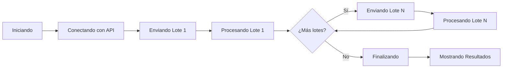

# Proceso de Importación

Una vez configurado el mapeo de campos, está listo para ejecutar la importación. Esta guía le acompañará durante todo el proceso.

## Antes de Comenzar

### Lista de Verificación

Antes de iniciar la importación, verifique:

- [ ] El archivo Excel está cerrado
- [ ] El mapeo de campos está completo
- [ ] Los campos obligatorios están mapeados
- [ ] La conexión con SAGE 50 es exitosa
- [ ] Ha guardado una copia de seguridad del archivo

!!! warning "Copias de Seguridad**

    Siempre mantenga una copia del archivo original antes de realizar importaciones masivas.

## Ejecutar la Importación

### Paso 1: Configurar Opciones

Antes de importar, configure las opciones:

| Opción | Descripción | Recomendación |
|--------|-------------|---------------|
| **Modo de inserción** | Insertar nuevos, actualizar existentes o ambos | Según necesidad |
| **Si existe código** | Omitir, actualizar o error | Omitir para duplicados |
| **Manejo de errores** | Detener o continuar | Continuar para lotes grandes |
| **Tamaño de lote** | Registros por envío | 100-500 según conexión |

### Paso 2: Vista Previa

Revise siempre los datos antes de importar:

1. Haga clic en **"Vista Previa"**
2. Verifique los primeros 10 registros
3. Confirme que el mapeo es correcto
4. Revise los formatos de fecha y números

!!! tip "Revise la Vista Previa**

    La vista previa le permite detectar problemas antes de importar todos los registros.

### Paso 3: Iniciar la Importación

1. Haga clic en el botón **"Importar"**
2. La barra de progreso aparecerá

3. El proceso mostrará información en tiempo real:
   - Registro actual / Total
   - Registros exitosos
   - Registros con error
   - Tiempo transcurrido y estimado

## Monitorear el Progreso

### Pantalla de Progreso

Durante la importación, verá:

### Información Mostrada

| Campo | Descripción |
|-------|-------------|
| **Registro actual** | Número del registro que se está procesando |
| **Total registros** | Cantidad total de registros a importar |
| **Progreso** | Porcentaje completado |
| **Exitosos** | Registros importados correctamente |
| **Con error** | Registros que fallaron |
| **Tiempo** | Tiempo transcurrido y tiempo estimado restante |

### Indicadores de Estado

| Indicador | Significado |
|-----------|-------------|
| :white_check_mark: Verde | Progreso normal |
| :warning: Amarillo | Advertencias, proceso continúa |
| :x: Rojo | Error, proceso detenido |

## Manejo de Errores Durante la Importación

### Errores por Registro

Si un registro tiene error:

1. El error se muestra en el log
2. El proceso continúa (si está configurado así)
3. El registro se marca como fallido

### Errores Críticos

Si ocurre un error crítico:

| Error | Causa | Acción |
|-------|-------|--------|
| **Pérdida de conexión** | SAGE 50 se cerró | Reinicie SAGE 50 y reconecte |
| **Validación fallida** | Dato inválido | Corrija el dato en Excel |
| **Timeout** | Lote muy grande | Reduzca tamaño de lote |
| **Memoria insuficiente** | Archivo muy grande | Cierre otras aplicaciones |

!!! tip "No Cierre la Aplicación**

    Mientras la importación está en progreso, no cierre xls2sage50 ni SAGE 50.

## Resultados de la Importación

### Resumen Final

Al completarse la importación, verá:

| Campo | Descripción |
|-------|-------------|
| **Registros leídos** | Total de registros del archivo Excel |
| **Registros importados** | Registros insertados/actualizados exitosamente |
| **Registros omitidos** | Registros no procesados (por duplicados, etc.) |
| **Registros con error** | Registros que fallaron |
| **Tiempo total** | Duración de todo el proceso |

### Detalle de Errores (si los hay)

Si hubo errores, puede ver el detalle:

1. Haga clic en **"Ver Errores"**
2. Revise cada error con su información:

| Columna | Descripción |
|---------|-------------|
| **Fila** | Número de fila en el archivo Excel |
| **Campo** | Campo que causó el error |
| **Valor** | Valor que se intentó importar |
| **Error** | Mensaje de error de SAGE 50 |

### Exportar Reporte

Puede exportar un reporte de la importación:

1. Haga clic en **"Exportar Reporte"**
2. Seleccione el formato (CSV, Excel, PDF)
3. El reporte incluye:
   - Resumen de la importación
   - Lista de registros exitosos
   - Lista de errores con detalles

!!! tip "Guarde el Reporte**

    El reporte es útil para auditoría y para corregir errores en importaciones futuras.

## Verificar en SAGE 50

Después de una importación exitosa:

### Paso 1: Abrir SAGE 50

1. Abra SAGE 50
2. Vaya al módulo correspondiente (Clientes, Artículos, etc.)

### Paso 2: Buscar los Registros

1. Use el buscador
2. Ingrese un código de un registro importado
3. Verifique que todos los datos son correctos

### Paso 3: Verificar la Cantidad

1. Genere un listado en SAGE 50
2. Cuenta la cantidad de registros
3. Verifique que coincide con el reporte de xls2sage50

## Acciones Posteriores

### Si la Importación Fue Exitosa

1. :white_check_mark: **Guarde el reporte** para auditoría
2. :white_check_mark: **Guarde la plantilla** para reutilizar
3. :white_check_mark: **Archive el archivo Excel** importado
4. :white_check_mark: **Notifique a los usuarios** del cambio

### Si Hubo Errores

1. :warning: **Revise el reporte de errores**
2. :warning: **Corrija los datos en el archivo Excel**
3. :warning: **Reimporte solo los registros con error**
4. :warning: **Documente los errores** para evitarlos en el futuro

## Importación Parcial

Para reintentar solo los registros con error:

1. En el reporte de errores, haga clic en **"Exportar Filas con Error"**
2. Se genera un archivo Excel solo con los registros fallidos
3. Corrija los datos en ese archivo
4. Impórtelo nuevamente

!!! tip "Importación Incremental**

    Para grandes volúmenes, considere importar en lotes más pequeños para facilitar la corrección de errores.

## Rendimiento y Optimización

### Tiempos Esperados

| Cantidad de Registros | Tiempo Estimado (API) |
|----------------------|----------------------|
| 100 | ~10 segundos |
| 1.000 | ~1 minuto |
| 10.000 | ~10 minutos |
| 100.000 | ~2 horas |

### Factores que Afectan el Rendimiento

| Factor | Impacto | Optimización |
|--------|---------|--------------|
| **Tamaño de lote** | Alto | Ajustar según conexión |
| **Complejidad de validación** | Medio | Simplificar datos |
| **Velocidad del servidor** | Alto | Usar servidor dedicado |
| **Carga de SAGE 50** | Medio | Importar en horas valle |

## Próximo Paso

- [Ejemplos de Uso](ejemplos.md) - Consulte casos prácticos detallados

!!! question "¿Problemas con la Importación?**

    Consulte [Errores de Importación](../../solucion-problemas/errores-importacion.md) para resolver problemas comunes.
