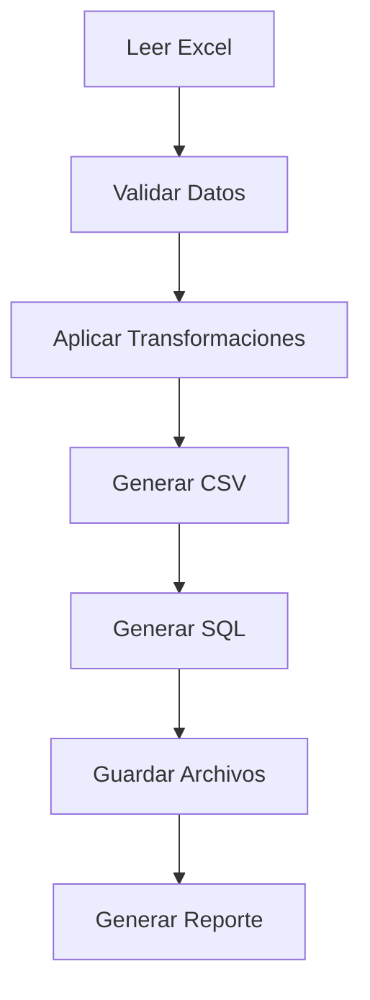

# Conceptos del Modo CSV

En esta section entenderá los conceptos fundamentales del modo CSV y cómo se generan los archivos para su importación en SAGE 50.

## ¿Qué es un Archivo CSV?

CSV significa **Comma-Separated Values** (valores separados por comas). Es un formato de texto simple donde cada línea representa un registro y los campos se separan por un carácter especial.

### Estructura de un Archivo CSV

```
 encabezado1,encabezado2,encabezado3
 valor1,valor2,valor3
 valor4,valor5,valor6
```

### Ejemplo Real

```csv
CodigoCliente,NombreCliente,NIF,Direccion
CLI001,"Juan Pérez, S.L.","B12345678","Calle Mayor, 1"
CLI002,"María López","A87654321","Avenida Libertad, 2"
```

!!! tip "Valores con Separadores**

    Cuando un valor contiene el carácter separador (como una coma dentro de una dirección), se encierra entre comillas dobles.

## Separadores

### Tipos de Separadores

| Separador | Carácter | Uso Típico |
|-----------|----------|------------|
| **Coma** | `,` | CSV estándar inglés |
| **Punto y coma** | `;` | CSV europeo y SAGE 50 |
| **Tabulador** | Tab | Archivos de texto delimitados |

### Separador Recomendado para SAGE 50

SAGE 50 utiliza preferiblemente el **punto y coma (;)** como separador, ya que es el estándar europeo y evita conflictos con los decimales (coma).

!!! warning "Use Punto y Coma**

    Asegúrese de configurar el separador como punto y coma para SAGE 50, ya que la coma puede causar problemas con los formatos numéricos españoles.

## Codificación de Caracteres

### UTF-8

Codificación universal que soporta todos los caracteres:

- :white_check_mark: Caracteres especiales (ñ, á, é, í, ó, ú)
- :white_check_mark: Emojis y símbolos
- :white_check_mark: Caracteres de múltiples idiomas

### Latin1 / Windows-1252

Codificación tradicional de Windows:

- :warning: Caracteres europeos limitados
- :warning: Problemas con caracteres especiales
- :x: No soporta caracteres no occidentales

!!! tip "Use UTF-8 con BOM**

    Para máxima compatibilidad con SAGE 50, use UTF-8 con BOM (Byte Order Mark).

## Formatos de Datos

### Formatos Numéricos

| Formato | Ejemplo | Notas |
|---------|---------|-------|
| **Decimal coma** | 1.234,56 | Formato español |
| **Decimal punto** | 1234.56 | Formato inglés |

SAGE 50 utiliza el formato español con coma decimal.

### Formatos de Fecha

| Formato | Ejemplo | Configuración |
|---------|---------|---------------|
| **DD/MM/AAAA** | 01/02/2024 | Formato español |
| **AAAA-MM-DD** | 2024-02-01 | Formato ISO |
| **DD-MM-AAAA** | 01-02-2024 | Con guiones |

!!! warning "Consistencia de Formatos**

    Asegúrese de que el formato de fecha en el CSV coincida con la configuración regional de SAGE 50.

## Generación de Archivos

### Proceso de Generación



### Archivos Generados

| Archivo | Contenido | Formato |
|---------|-----------|---------|
| `datos.csv` | Registros en formato CSV | UTF-8 |
| `datos.sql` | Sentencias SQL INSERT | UTF-8 |
| `importacion.log` | Registro del proceso | UTF-8 |
| `errores.log` | Errores encontrados | UTF-8 |

## Características Especiales

### Manejo de Comillas

Cuando un valor contiene comillas:

```
Valor: "Empresa ABC" → CSV: """Empresa ABC"""
```

### Valores Multilínea

Los valores con saltos de línea se encierran en comillas:

```csv
Codigo,Direccion
CLI001,"Calle Mayor 1
Piso 2
Puerta A"
```

### Valores Vacíos

Los campos sin valor se representan con dos separadores consecutivos:

```csv
CLI001,Nombre,,,Madrid
```

En este ejemplo, el tercer y cuarto campos están vacíos.

## Configuración de Salida

### Opciones Disponibles

| Opción | Valores | Predeterminado |
|--------|---------|----------------|
| Separador | `,`, `;`, Tab | `;` |
| Codificación | UTF-8, Latin1 | UTF-8 |
| Incluir BOM | Sí, No | Sí |
| Comillas | Siempre, Solo necesarias | Solo necesarias |
| Saltos de línea | CRLF, LF | CRLF |

### Configuración Recomendada para SAGE 50

```yaml
separador: ";"
codificacion: "UTF-8"
incluir_bom: true
comillas: "solo_necesarias"
saltos_de_linea: "CRLF"
```

## Rendimiento

### Tamaños de Archivo

| Registros | Tamaño Aprox. | Tiempo de Generación |
|-----------|---------------|---------------------|
| 100 | ~10 KB | < 1 segundo |
| 1.000 | ~100 KB | ~2 segundos |
| 10.000 | ~1 MB | ~15 segundos |
| 100.000 | ~10 MB | ~2 minutos |

!!! tip "Archivos Grandes**

    Para archivos muy grandes, considere dividir la exportación en varios archivos más pequeños.

## Próximo Paso

- [Configuración CSV](configuracion.md) - Configure las opciones de generación
