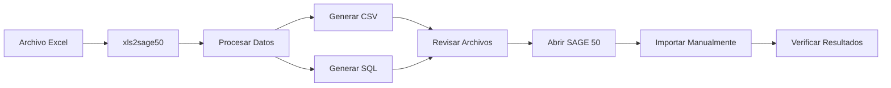

# Modo de Generación CSV

El modo CSV genera archivos de texto CSV y scripts SQL que pueden importarse manualmente en SAGE 50. Es ideal cuando no tiene acceso a la API de SAGE 50.

## Ventajas del Modo CSV

| Ventaja | Descripción |
|---------|-------------|
| :white_check_mark: **Sin licencia API** | No requiere licencia especial de SAGE 50 |
| :white_check_mark: **Compatible con todas las versiones** | Funciona con cualquier versión de SAGE 50 |
| :white_check_mark: **Revisión previa** | Permite revisar los datos antes de importar |
| :white_check_mark: **Control total** | Usted decide cuándo y cómo importar |
| :white_check_mark: **Auditable** | Los archivos generados sirven de auditoría |

## Cuándo Usar el Modo CSV

!!! info "Situaciones Ideales para Modo CSV"

    - No tiene licencia API de SAGE 50
    - Prefiere revisar los datos antes de importar
    - Su empresa requiere proceso de aprobación previo
    - Importa datos con poca frecuencia
    - Usa una versión antigua de SAGE 50

## Contenido de esta Sección

1. [Conceptos Básicos](conceptos.md) - Arquitectura y funcionamiento
2. [Configuración CSV](configuracion.md) - Formatos y opciones de generación
3. [Generación de SQL](generacion-sql.md) - Scripts SQL para importación
4. [Importación Manual](importacion-manual.md) - Pasos para importar en SAGE 50

## Flujo de Trabajo del Modo CSV



## Formatos de Salida

El modo CSV puede generar dos tipos de archivos:

### Archivos CSV

Archivos de texto con valores separados por comas:

```csv
CodigoCliente,NombreCliente,NIF,Direccion,Poblacion,Provincia
CLI001,"Juan Pérez SL","B12345678","C/ Mayor 1","Madrid","Madrid"
CLI002,"María López SA","A87654321","Av. Libertad 2","Barcelona","Barcelona"
```

### Scripts SQL

Archivos con sentencias SQL para importación directa:

```sql
INSERT INTO Clientes (CodigoCliente, NombreCliente, NIF, Direccion, Poblacion, Provincia)
VALUES ('CLI001', 'Juan Pérez SL', 'B12345678', 'C/ Mayor 1', 'Madrid', 'Madrid');

INSERT INTO Clientes (CodigoCliente, NombreCliente, NIF, Direccion, Poblacion, Provincia)
VALUES ('CLI002', 'María López SA', 'A87654321', 'Av. Libertad 2', 'Barcelona', 'Barcelona');
```

## Comparación con Modo API

| Característica | Modo CSV | Modo API |
|----------------|----------|----------|
| **Licencia API** | No necesaria | Requerida |
| **Intervención manual** | Requerida | Automática |
| **Velocidad** | Más lento | Muy rápido |
| **Validación** | Posterior | Inmediata |
| **Ideal para** | Importaciones ocasionales | Importaciones frecuentes |

## Archivos Generados

xls2sage50 genera los siguientes archivos en la carpeta de salida:

| Archivo | Descripción |
|---------|-------------|
| `clientes.csv` | Archivo CSV con los datos |
| `clientes.sql` | Script SQL para importación |
| `importacion.log` | Registro del proceso |
| `errores.log` | Errores encontrados (si los hay) |

!!! note "Ubicación de Archivos**

    Los archivos se guardan en `%USERPROFILE%\Documents\xls2sage50\csv\` por defecto.

## Próximo Paso

- [Conceptos Básicos](conceptos.md) - Entienda cómo funciona el modo CSV
