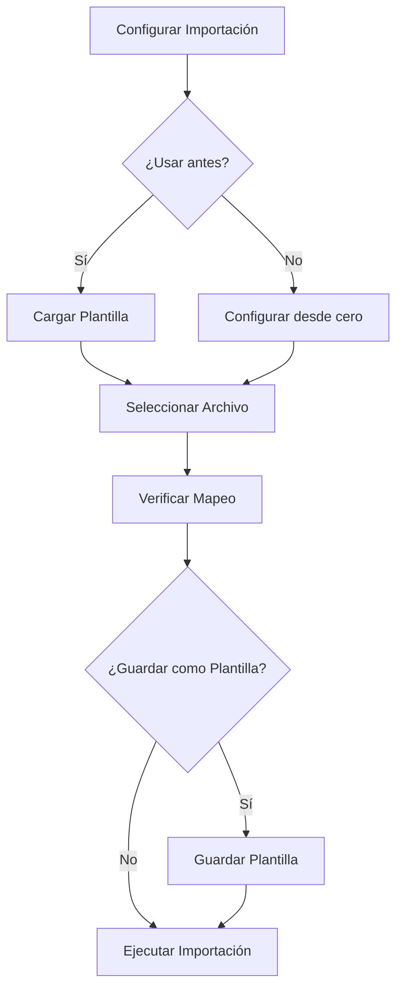

# Gestión de Plantillas

Las plantillas le permiten guardar configuraciones de importación para reutilizarlas en futuros procesos, ahorrando tiempo y asegurando consistencia.

## ¿Qué es una Plantilla?

Una plantilla es un archivo que contiene:

- [ ] Mapeo de campos (columnas Excel → campos SAGE 50)
- [ ] Opciones de importación
- [ ] Transformaciones de datos
- [ ] Reglas de validación
- [ ] Metadatos (nombre, descripción, fecha)

!!! tip "Ahorre Tiempo con Plantillas**

    Si realiza la misma importación regularmente (por ejemplo, clientes mensuales), usar plantillas reduce el tiempo de horas a segundos.

## Ventajas de Usar Plantillas

| Ventaja | Descripción |
|---------|-------------|
| :white_check_mark: **Ahorro de tiempo** | No necesita reconfigurar cada vez |
| :white_check_mark: **Consistencia** | Mismos parámetros en cada importación |
| :white_check_mark: **Menor errores** | Menor riesgo de errores humanos |
| :white_check_mark: **Estandarización** | Procesos consistentes entre usuarios |
| :white_check_mark: **Compartible** | Puede compartir plantillas con otros |

## Contenido de esta Sección

1. [Crear Plantilla](crear.md) - Crear una nueva plantilla desde cero
2. [Usar Plantilla](usar.md) - Cargar y usar una plantilla existente
3. [Editar y Eliminar](editar.md) - Modificar o borrar plantillas
4. [Plantillas Predefinidas](predefinidas.md) - Plantillas incluidas con la aplicación

## Sección de Plantillas

Acceda a las plantillas desde:

1. Barra lateral de navegación, icono :material.bookmark:
2. O desde **Configuración** > **Plantillas**


## Lista de Plantillas

La sección muestra todas las plantillas disponibles:

| Columna | Descripción |
|---------|-------------|
| **Nombre** | Nombre de la plantilla |
| **Descripción** | Descripción breve de su uso |
| **Fecha** | Fecha de creación o última modificación |
| **Tipo** | API o CSV |
| **Entidad** | Clientes, Artículos, etc. |

## Flujo de Trabajo con Plantillas



## Tipos de Plantillas

### Por Modo de Importación

| Tipo | Descripción | Ejemplo |
|------|-------------|---------|
| **API** | Para importación directa por API | Clientes_API_Mensual |
| **CSV** | Para generación de archivos CSV | Artículos_CSV_Precios |

### Por Entidad

| Entidad | Descripción |
|---------|-------------|
| **Clientes** | Importación de clientes y prospects |
| **Proveedores** | Importación de proveedores |
| **Artículos** | Importación de catálogo de productos |
| **Asientos** | Importación de asientos contables |
| **Facturas** | Importación de facturas |

## Archivo de Plantilla

Las plantillas se guardan en formato `.PREDEFINIDO`:

```
%USERPROFILE%\Documents\xls2sage50\plantillas\
```

### Estructura del Archivo

```json
{
  "nombre": "Clientes_Mensual",
  "descripcion": "Importación mensual de clientes",
  "version": "1.0",
  "fecha_creacion": "2024-01-15",
  "fecha_modificacion": "2024-02-01",
  "modo": "API",
  "entidad": "Clientes",
  "mapeo": {
    "CODIGO": "CodigoCliente",
    "NOMBRE": "NombreCliente",
    "NIF": "NIF",
    "DIRECCION": "Direccion",
    "POBLACION": "Poblacion",
    "PROVINCIA": "Provincia",
    "CP": "CodigoPostal",
    "TELEFONO": "Telefono1",
    "EMAIL": "Email"
  },
  "opciones": {
    "insertar_nuevos": true,
    "actualizar_existentes": false,
    "validar_nif": true
  },
  "transformaciones": [],
  "validaciones": [
    {
      "campo": "NIF",
      "tipo": "expresion_regular",
      "patron": "^[0-9A-Z][0-9]{7}[A-Z0-9]$"
    }
  ]
}
```

## Exportar e Importar Plantillas

### Exportar Plantilla

Para compartir una plantilla con otros usuarios:

1. Seleccione la plantilla en la lista
2. Haga clic en **"Exportar"**
3. Seleccione la ubicación y nombre del archivo
4. Haga clic en **"Guardar"**

### Importar Plantilla

Para usar una plantilla recibida de otro usuario:

1. Haga clic en **"Importar"**
2. Busque el archivo `.PREDEFINIDO`
3. Seleccione el archivo
4. Haga clic en **"Abrir"**

!!! tip "Plantillas Compartidas**

    Use plantillas compartidas para asegurar que todos los usuarios de la empresa usen la misma configuración.

## Próximo Paso

- [Crear Plantilla](crear.md) - Cree su primera plantilla
