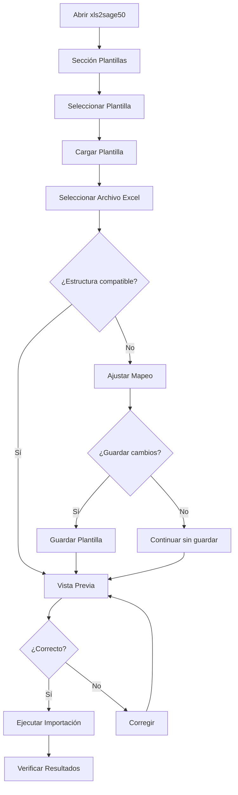

# Usar Plantilla

Esta guía le enseñará a cargar y usar plantillas guardadas para ejecutar importaciones rápidamente.

## Cargar una Plantilla

### Paso 1: Acceder a las Plantillas

1. Abra xls2sage50
2. Vaya a la sección **Plantillas** (icono :material.bookmark:)


### Paso 2: Seleccionar la Plantilla

1. Busque la plantilla que desea usar en la lista
2. Puede usar el buscador para filtrar por nombre
3. Seleccione la plantilla

### Paso 3: Cargar la Plantilla

Haga clic en **"Cargar"** o doble clic en la plantilla.

La plantilla se cargará y verá:

- El mapeo de campos configurado
- Las opciones de importación
- Las validaciones definidas

## Ejecutar Importación con Plantilla

### Paso 1: Seleccionar el Archivo

Una vez cargada la plantilla:

1. Haga clic en **"Seleccionar Archivo"**
2. Busque el archivo Excel que desea importar
3. Seleccione el archivo

!!! tip "Nombre de Archivo**

    El archivo debe tener la misma estructura que usó al crear la plantilla (mismas columnas).

### Paso 2: Verificar la Configuración

Revise que la configuración cargada es correcta:

| Elemento | Qué Verificar |
|----------|---------------|
| **Mapeo** | Todas las columnas están mapeadas |
| **Opciones** | Las opciones son las deseadas |
| **Validaciones** | Las reglas son apropiadas |

### Paso 3: Vista Previa

Siempre realice una vista previa:

1. Haga clic en **"Vista Previa"**
2. Revise los primeros 10 registros
3. Verifique que los datos se ven correctamente

!!! warning "Revise Siempre la Vista Previa**

    Si el archivo tiene una estructura diferente al usado para crear la plantilla, la importación podría fallar.

### Paso 4: Ejecutar

Si todo es correcto:

1. Haga clic en **"Importar"**
2. Espere a que finalice el proceso
3. Revise los resultados

## Modificar Temporalmente una Plantilla

Si necesita hacer cambios temporales sin modificar la plantilla:

1. Cargue la plantilla
2. Realice los cambios necesarios (mapeo, opciones)
3. **No guarde** la plantilla
4. Ejecute la importación

Los cambios no se guardarán y la plantilla permanecerá intacta.

!!! tip "Guardar como Nueva Plantilla**

    Si desea conservar los cambios, use **"Guardar como"** con un nombre diferente en lugar de sobrescribir la original.

## Plantillas y Archivos con Estructura Diferente

Si el archivo tiene una estructura diferente:

### Opción A: Crear Nueva Plantilla

1. Configure el mapeo para el nuevo archivo
2. Guárdelo como una plantilla nueva

### Opción B: Modificar la Plantilla Existente

1. Cargue la plantilla
2. Modifique el mapeo
3. Haga clic en **"Guardar"** (sobrescribir)

### Opción C: Usar Mapeo Inteligente

xls2sage50 intentará adaptar el mapeo:

- Columnas con nombres similares se asocian automáticamente
- Columnas sin equivalencia se marcan para revisión

## Flujo Completo con Plantilla



## Atajos de Teclado

| Atajo | Acción |
|-------|--------|
| `Ctrl + L` | Abrir lista de plantillas |
| `Ctrl + Shift + L` | Cargar última plantilla usada |
| `F5` | Actualizar lista de plantillas |

## Automatización con Plantillas

### Uso desde Línea de Comandos

```bash
# Ejecutar una plantilla específica
python xls2sage50.py run --template="Clientes_Mensual" --file="clientes_febrero.xlsx"

# Ejecutar con opciones adicionales
python xls2sage50.py run --template="Clientes_Mensual" --file="clientes_febrero.xlsx" --dry-run
```

### Script por Lotes

```batch
@echo off
REM Importación automática con plantilla

set ARCHIVO=%1
set PLANTILLA=Clientes_Mensual

if "%ARCHIVO%"=="" (
    echo Uso: importar.bat archivo.xlsx
    exit /b 1
)

python xls2sage50.py run --template=%PLANTILLA% --file=%ARCHIVO%

if %ERRORLEVEL% EQU 0 (
    echo Importacion exitosa
) else (
    echo Error en importacion
    exit /b 1
)
```

## Problemas Comunes

### Problema: Columnas No Reconocidas

!!! error "Algunas columnas no se mapean"

    **Causa:** El archivo tiene columnas diferentes al usado para crear la plantilla

    **Solución:**
    - Verifique que los nombres de columnas coinciden
    - Ajuste el mapeo manualmente
    - Considere crear una nueva plantilla

### Problema: Archivo con Columnas Adicionales

!!! error "El archivo tiene columnas que no están en la plantilla"

    **Causa:** El archivo tiene más columnas que las esperadas

    **Solución:**
    - Las columnas adicionales se ignoran automáticamente
    - Si desea usarlas, añádalas al mapeo
    - Guarde una nueva versión de la plantilla

## Próximo Paso

- [Editar y Eliminar](editar.md) - Modifique o elimine plantillas existentes

!!! question "¿Necesita Crear una Plantilla?**

    Si aún no tiene plantillas, consulte [Crear Plantilla](crear.md) para aprender a crearlas.
