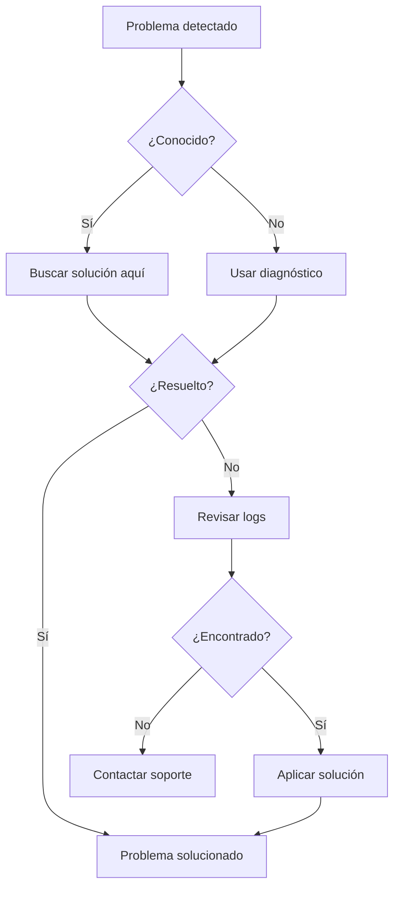

# Solución de Problemas

Esta sección le ayuda a resolver problemas comunes que pueda encontrar al usar xls2sage50.

## Contenido de esta Sección

1. [Problemas Comunes](comunes.md) - Errores generales y soluciones
2. [Errores de Conexión](errores-conexion.md) - Problemas con SAGE 50 API
3. [Errores de Importación](errores-importacion.md) - Problemas durante la importación
4. [Contacto y Soporte](soporte.md) - Cómo obtener ayuda adicional

## Diagnóstico Rápido

### Herramienta de Diagnóstico

xls2sage50 incluye una herramienta de diagnóstico:

1. Abra xls2sage50
2. Vaya a **Ayuda** > **Diagnóstico del Sistema**
3. Haga clic en **"Generar Informe"**
4. Revise los resultados

El diagnóstico verifica:

- [ ] Versión de xls2sage50
- [ ] Conexión con SAGE 50
- [ ] Espacio en disco
- [ ] Permisos de archivos
- [ ] Configuración del sistema

## Problemas por Categoría

### Instalación

| Problema | Solución |
|----------|----------|
| No se instala | Verifique permisos de administrador |
| Faltan dependencias | Reinstale con conexión a internet |
| Error al iniciar | Compruebe que Python 3.12+ está instalado |

### Conexión

| Problema | Solución |
|----------|----------|
| No conecta con SAGE 50 | Verifique que SAGE 50 está abierto |
| Timeout | Aumente el valor de timeout |
| Puerto bloqueado | Configure el firewall |

### Importación

| Problema | Solución |
|----------|----------|
| Archivo no se lee | Verifique formato y codificación |
| Mapeo incorrecto | Revise nombres de columnas |
| Errores de validación | Corrija los datos en Excel |

## Flujo de Solución de Problemas



## Logs y Archivos de Registro

### Ubicación de Logs

Los archivos de registro se encuentran en:

```
%USERPROFILE%\Documents\xls2sage50\logs\
├── xls2sage50.log      ← Log principal
├── error.log           ← Solo errores
└── debug.log           ← Log de depuración
```

### Ver el Log

Para ver el log actual:

1. Vaya a **Configuración** > **Logs**
2. Haga clic en **"Ver Log Actual"**
3. El log se abrirá en el visor de logs

### Niveles de Log

| Nivel | Descripción |
|-------|-------------|
| **DEBUG** | Información detallada de depuración |
| **INFO** | Información general |
| **WARNING** | Advertencias |
| **ERROR** | Errores que ocurrieron |
| **CRITICAL** | Errores críticos |

## Recuperación de Errores

### Exportar Informe de Error

Cuando ocurre un error:

1. Anote el mensaje de error
2. Haga clic en **"Exportar Informe"**
3. Guarde el archivo `.zip`
4. Incluya este archivo si contacta soporte

### Modo Seguro

Si la aplicación falla al iniciar:

1. Abra una terminal
2. Navegue al directorio de instalación
3. Ejecute: `xls2sage50.exe --safe-mode`
4. La aplicación iniciará con configuración mínima

!!! tip "Modo Seguro**

    El modo seguro deshabilita plugins y configuraciones personalizadas, útil para aislar problemas.

## Checklist de Solución de Problemas

Antes de contactar soporte, verifique:

- [ ] xls2sage50 está actualizado a la última versión
- [ ] SAGE 50 está instalado y funciona correctamente
- [ ] El archivo Excel tiene el formato correcto
- [ ] Ha revisado el log de errores
- [ ] Ha probado con un archivo de ejemplo
- [ ] Ha reiniciado el equipo
- [ ] Tiene espacio en disco suficiente
- [ ] Su antivirus no está bloqueando la aplicación

## Próximo Paso

- [Problemas Comunes](comunes.md) - Errores frecuentes y sus soluciones

!!! question "¿Necesita Ayuda Inmediata?**

    Consulte la sección de [Contacto y Soporte](soporte.md) para obtener ayuda del equipo técnico.
